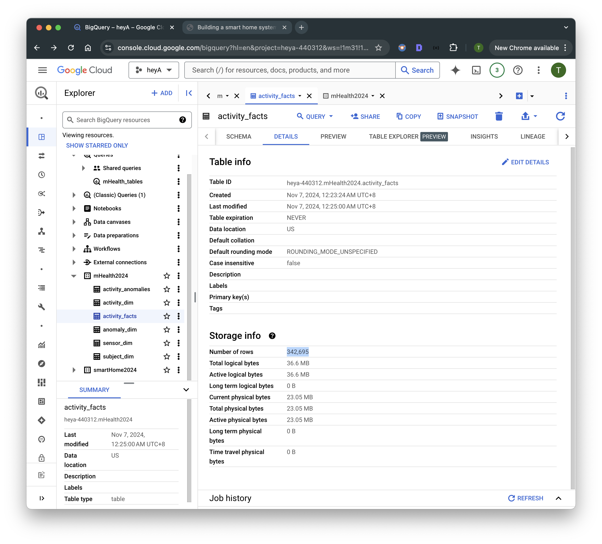
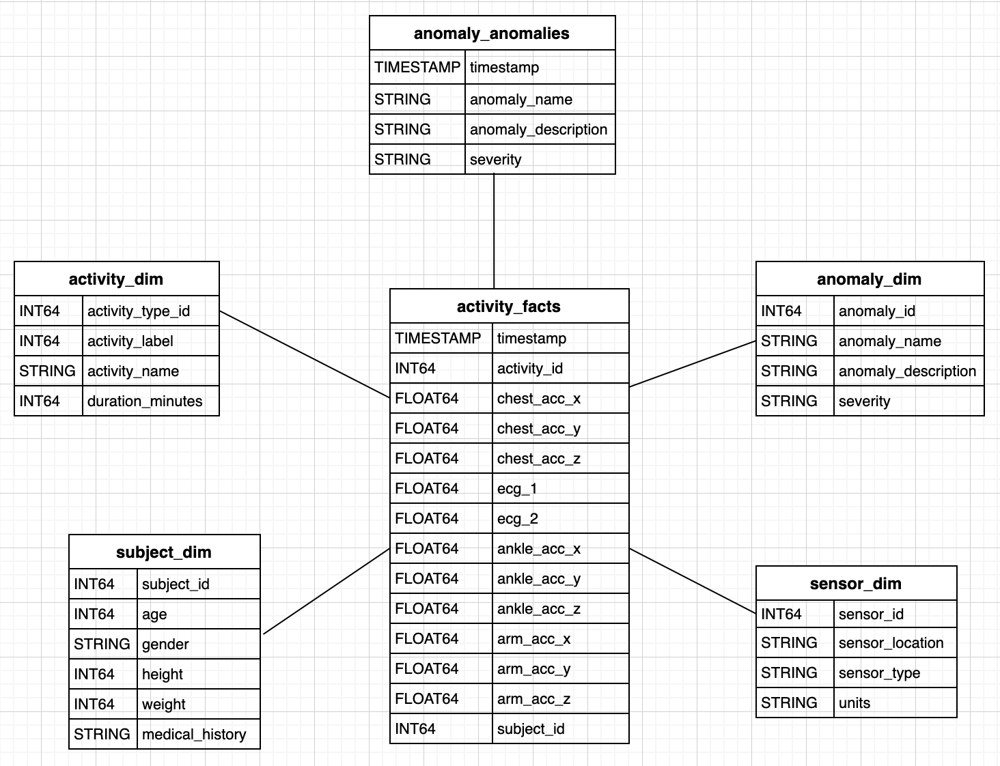
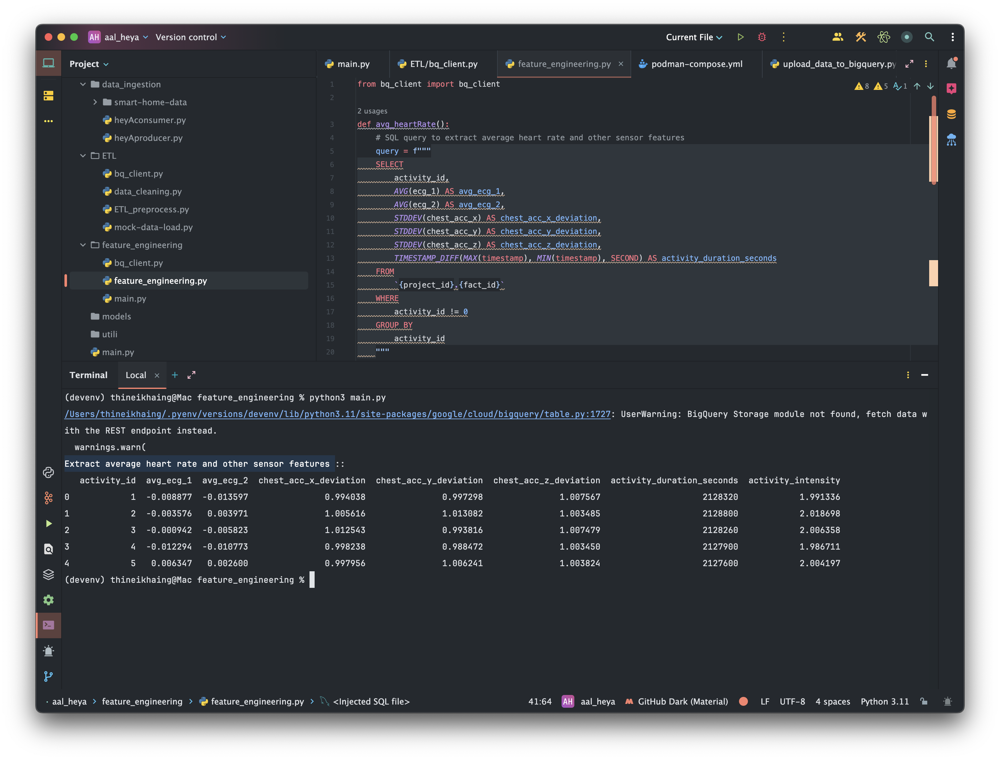
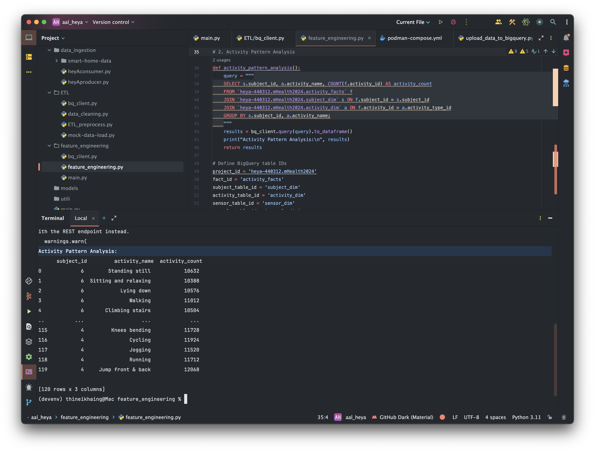
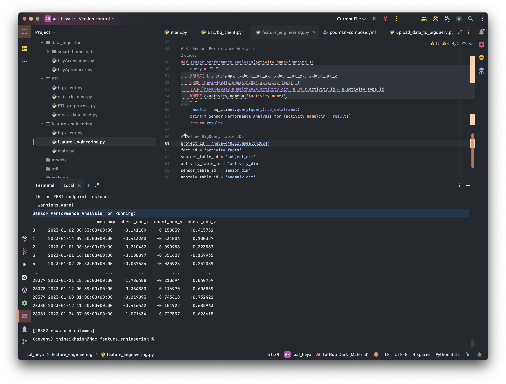
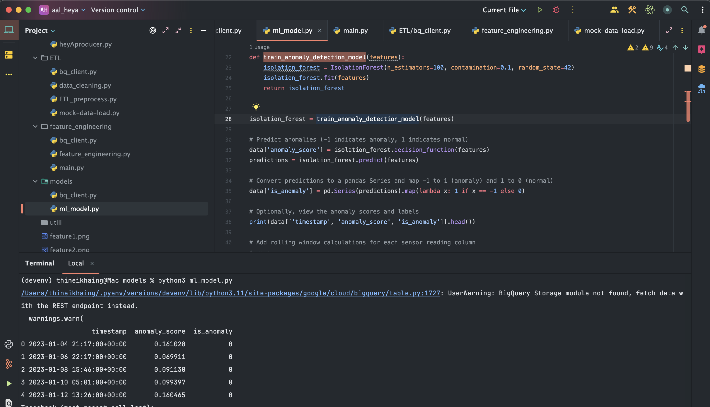
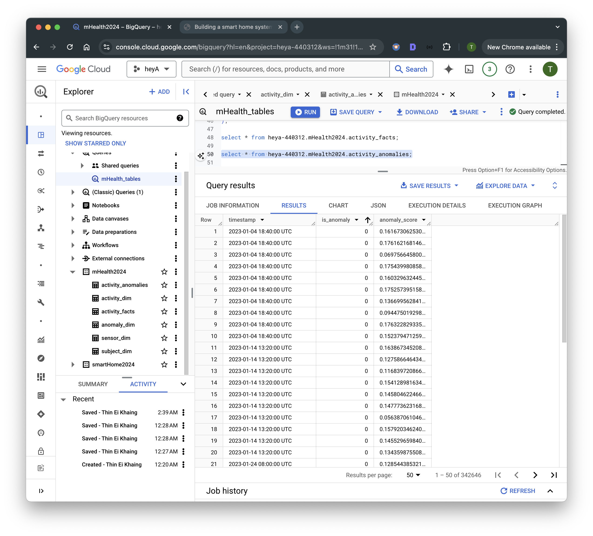
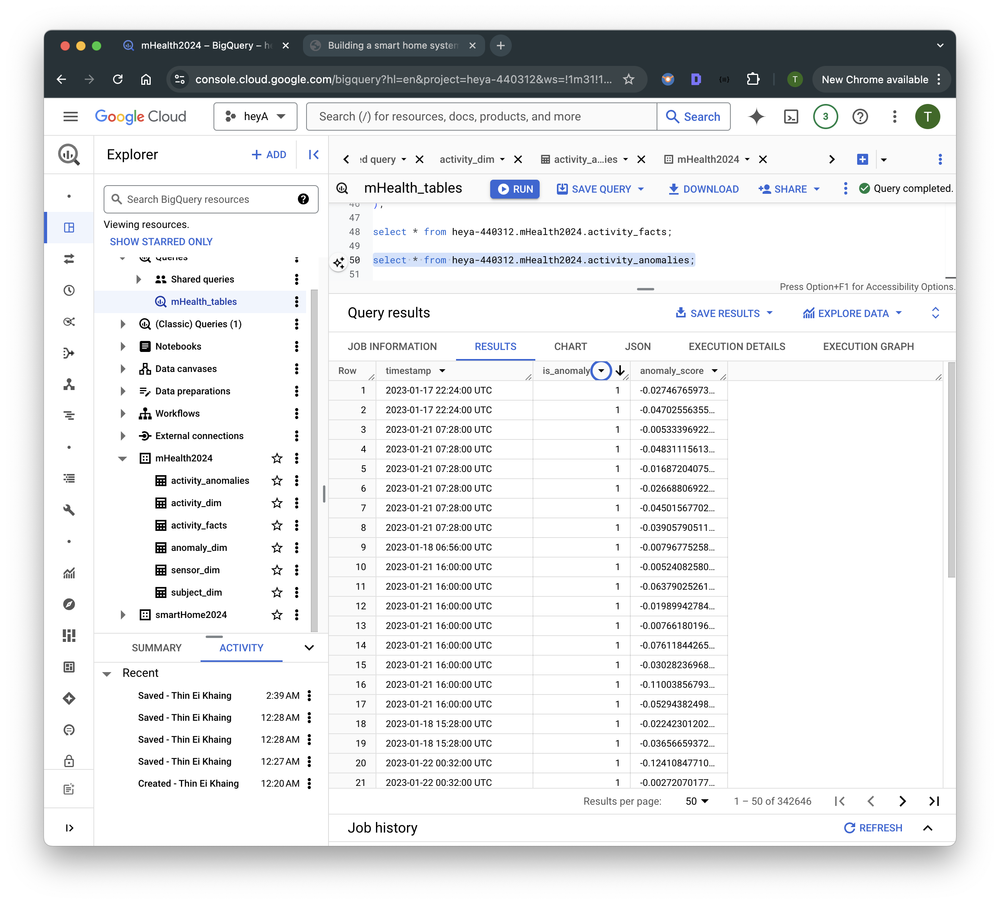
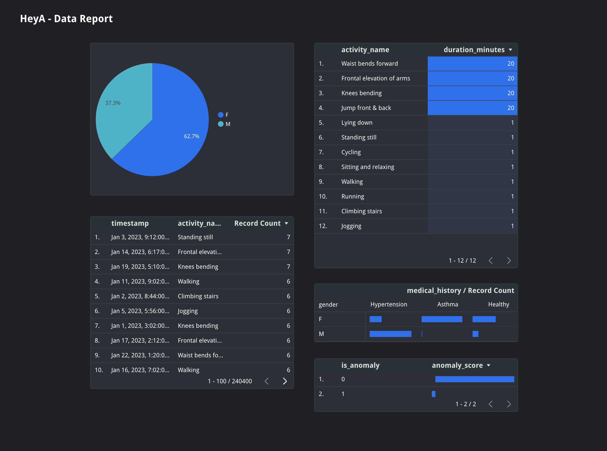

## HeyA! - Intelligent ambient assisted living (AAL) environment with ML ##

**Objective:** 

Design a data pipeline and machine learning model that collects, processes, and analyzes sensor data to detect anomalies in the daily routines of elderly individuals.

*Key Outcomes:*
- Real-time anomaly detection.
- Alert system for caregivers.
- Dashboard for monitoring activity patterns and deviations.

**MHEALTH (Mobile Health) Dataset:**

Contains sensor data for body movements and physiological signals such as ECG, accelerometer, and gyroscope signals collected from wearable sensors on different body parts.
Available on the UCI Machine Learning Repository.

**Data Storage**

Google Big Query

**Star Schema Design for mHealth Data**
1. Fact Table: activity_fact
The fact table holds the core, granular data with sensor readings and activity labels. Each row represents a sensor reading at a given timestamp for a specific activity performed by a subject.
2. Dimension Tables
The dimension tables store descriptive information about activities, subjects, sensor types, and anomalies. These tables help us analyze data by grouping or filtering based on these attributes.

**Data Transformation**
- Use Apache Spark or AWS Glue to process and clean data.
- Create ETL jobs to handle transformations like timestamp formatting, null value handling, and data aggregation.

**Machine Learning Layer**
- Feature Engineering:
1. Extract average heart rate and other sensor features

2. Activity Pattern Analysis

3. Sensor Performance Analysis

- Model Development:

**Model Training and Evaluation**
Anomaly Detection Algorithms: 
Use algorithm - Isolation Forest

**Store Detected Anomalies Back to BigQuery**

**Data Visualization and Monitoring Dashboard**

Build a monitoring dashboard using tools with *Google Data Studio (Looker Studio)*
Include visualizations such as time-series plots, daily activity patterns, anomaly occurrence graphs, and overall health scores.
- Real-Time Insights:

Display real-time metrics, alerts, and system health on the dashboard.
Implement custom views for different stakeholders (e.g., elderly individual’s family, caregivers, health providers).

Model Training and Evaluation
After preparing the dataset:

## Future Work ##

**Alerting and Notification System**
- Event Trigger System:

Set up alerts using services like AWS Lambda, Apache Airflow, or custom scripts to monitor real-time predictions.
Configure the system to trigger alerts when an anomaly (e.g., an unexpected drop in activity) is detected.
- Notification Channels:

Integrate with SMS, email, or mobile push notifications to alert caregivers and family members of anomalies.
Consider a configurable threshold setting for different users to customize alerts based on sensitivity.
